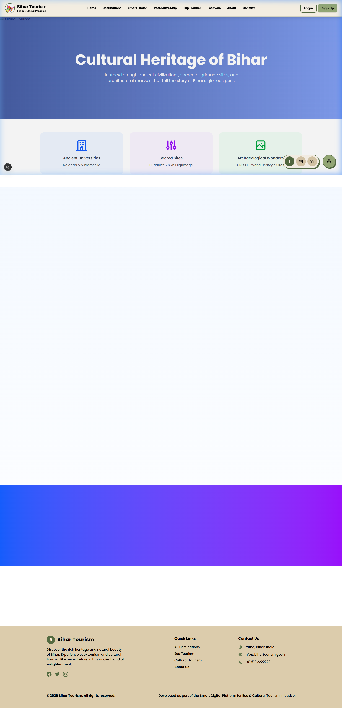
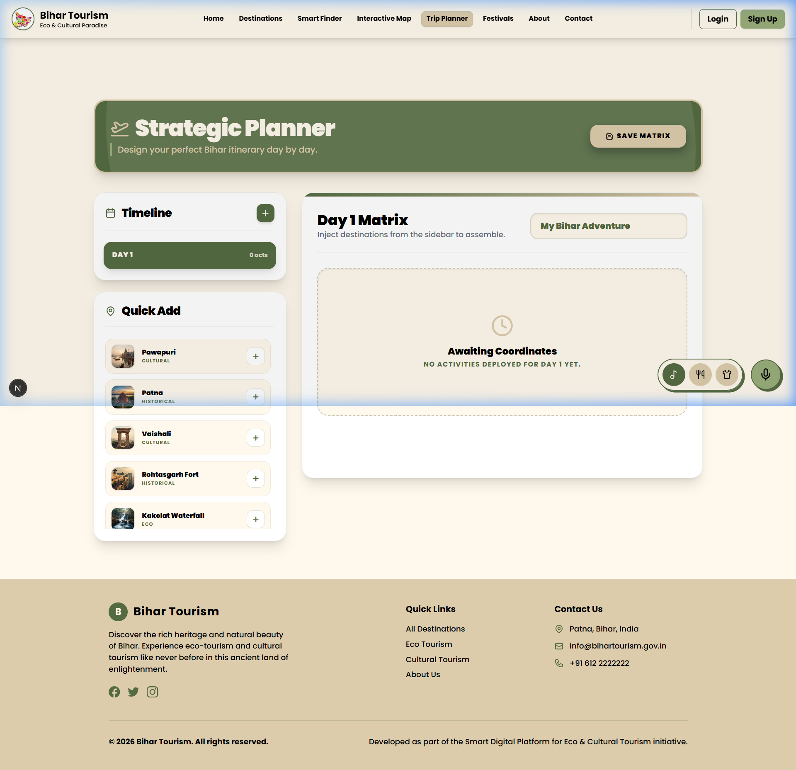
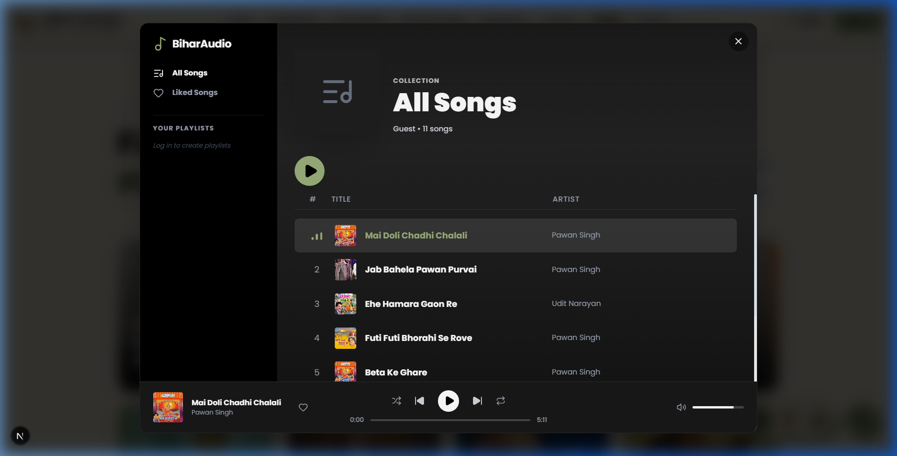
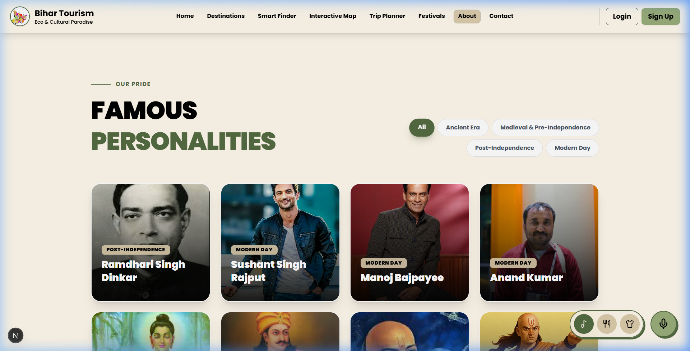

# 🏛️ Bihar Tourism: A Smart Digital Ecosystem


## 🌟 Overview

**Bihar Tourism** is a state-of-the-art, full-stack digital platform designed to revolutionize the tourism experience in Bihar, India. By blending ancient cultural heritage with cutting-edge technology, the platform offers an immersive journey through the "Land of Enlightenment."

Built with a focus on **Eco-Tourism** and **Cultural Heritage**, the application provides users with interactive maps, AI-powered travel assistance, a premium cultural showcase, and a seamless itinerary planner.

---

## 🖼️ Platform Visuals

<table align="center">
  <tr>
    <td align="center"><b>Landing Page</b><br></td>
    <td align="center"><b>Destinations Grid</b><br></td>
  </tr>
  <tr>
    <td align="center"><b>Cultural Heritage</b><br></td>
    <td align="center"><b>Strategic Planner</b><br></td>
  </tr>
  <tr>
    <td align="center"><b>BiharAudio Music Player</b><br></td>
    <td align="center"><b>Famous Personalities</b><br></td>
  </tr>
</table>

---

## 🚀 Advanced Features

### 🤖 AI-Powered Intelligence
The platform leverages **Google Gemini AI** to provide a truly smart tourism experience:
- **Contextual Recommendations**: Get travel suggestions based on your interests, budget, and the current season.
- **Personality Insights**: Deep-dive into the lives of Bihar's famous personalities with AI-generated biographical summaries.
- **AI Voice Assistant**: A fully interactive voice-controlled assistant that helps you navigate the site and answers your travel-related queries in real-time.

### 🗺️ Interactive Exploration
- **Tactical Mapping**: Built with `Leaflet.js`, the interactive map features custom iconography for Eco and Cultural sites, real-time filtering, and interactive popups.
- **360° Matrix Projection**: An advanced 3D visualization layer using `React Three Fiber` that allows users to experience Bihar's landmarks in a virtual space.
- **Augmented Experience**: Integrated 360° panoramas providing a high-fidelity virtual tour of sacred sites and forest reserves.

### 🎭 Cultural & Heritage Hub
- **BiharAudio**: A premium, Spotify-inspired music player that showcases the rich folk and classical music traditions of Bihar.
- **Heritage Showcase**: Dedicated immersive sections for Bihar's unique cuisine, traditional attire, and historical timeline.
- **Famous Personalities**: A curated gallery of legends—from ancient philosophers like Aryabhata to modern-day heroes—with interactive bio-cards.

### 📅 Strategic Travel Planner
- **Dynamic Itineraries**: Build, save, and manage complex travel plans using the "Strategic Planner."
- **Dashboard Integration**: Secure user accounts keep all your plans, bookmarks, and reviews in one place.
- **Export to PDF**: Generate high-quality, professional travel brochures of your custom itinerary with a single click using `jspdf` and `html2canvas`.

---

## 🛠️ Tech Stack & Architecture

### 🌐 Frontend (Modern React Ecosystem)
- **Framework**: `Next.js 15` (App Router) for superior performance and SEO.
- **Styling**: `Tailwind CSS 4.0` with custom design tokens for a "Modern Heritage" aesthetic.
- **Animations**: `Framer Motion` for smooth micro-interactions and page transitions.
- **Visualization**: `Three.js` & `Recharts` for interactive 3D and data analytics.

### ⚡ Backend (Scalable Micro-Architecture)
- **Environment**: `Node.js` & `Express.js` REST API.
- **Database**: `MongoDB` with `Mongoose` for flexible data modeling.
- **Authentication**: `JWT` (JSON Web Tokens) with secure password hashing via `bcryptjs`.
- **Media**: `Multer` for handling high-quality image and audio uploads.

---

## 📁 Detailed Project Structure

```bash
Capstone-Project/
├── backend/                # API Service Layer
│   ├── controllers/        # Logical Request Handlers
│   ├── models/             # Data Schemas (User, Destination, Itinerary)
│   ├── routes/             # RESTful API Endpoints
│   ├── middleware/         # Auth & Error Handlers
│   ├── uploads/            # Local Asset Storage
│   └── server.js           # Server Entry & DB Connection
├── bihar-tourism/          # Client Interface
│   ├── src/
│   │   ├── app/            # Next.js Pages & Layouts
│   │   ├── components/     # Atomic UI Components
│   │   ├── lib/            # API Clients & Utility Functions
│   │   ├── types/          # TypeScript Definitions
│   │   └── data/           # Static Constants
│   └── public/             # Static Assets & Global Styles
└── docs/                   # Platform Documentation
    └── assets/             # Brand Assets & Screenshots
```

---

## ⚙️ Quick Start

### 1. Prerequisites
- Node.js (v18+)
- MongoDB (Local or Atlas)
- Google Cloud API Key (for Gemini)

### 2. Installation
```bash
# Clone the repo
git clone https://github.com/abhi170212/Capstone-Project.git

# Backend Setup
cd backend
npm install
# Configure .env: PORT, MONGODB_URI, JWT_SECRET, GOOGLE_API_KEY
npm run dev

# Frontend Setup
cd ../bihar-tourism
npm install
npm run dev
```

The application will be live at `http://localhost:3000`.

---

## 🎨 Design Philosophy
The UI follows a **Neobrutalist & Modern Heritage** philosophy. We use high-contrast "Nature Green" and "Ancient Sand" color palettes, bold typography, and glassmorphism effects to bridge the gap between Bihar's historical depth and a futuristic digital experience.

---

**Developed with ❤️ to showcase the beauty of Bihar.**