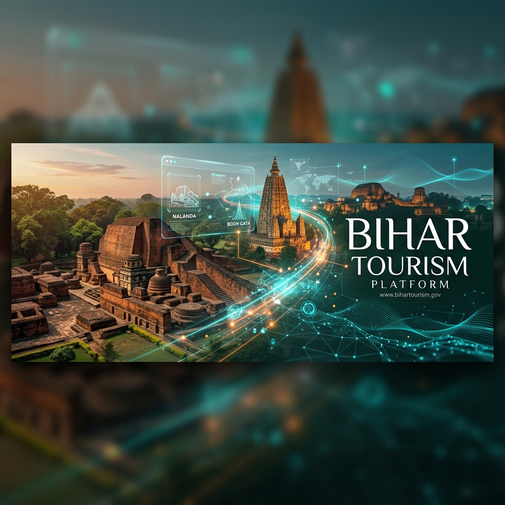

# 🏛️ Bihar Tourism: A Smart Digital Ecosystem



## 🌟 Overview

**Bihar Tourism** is a state-of-the-art, full-stack digital platform designed to revolutionize the tourism experience in Bihar, India. By blending ancient cultural heritage with cutting-edge technology, the platform offers an immersive journey through the "Land of Enlightenment."

Built with a focus on **Eco-Tourism** and **Cultural Heritage**, the application provides users with interactive maps, AI-powered travel assistance, a premium cultural showcase, and a seamless itinerary planner.

---

## 🚀 Key Features

### 🗺️ Interactive Exploration
- **Tactical Mapping**: Detailed interactive maps using Leaflet.js with custom markers for Eco and Cultural sites.
- **3D & AR Integration**: Immersive 3D visualizations using Three.js and React Three Fiber.
- **360° Panoramas**: Virtual tours of Bihar's most iconic landmarks.

### 🤖 AI-Powered Experience
- **Gemini AI Integration**: Context-aware travel recommendations and personality insights.
- **Voice Assistant**: Interactive AI voice assistant for hands-free navigation and queries.

### 🎭 Cultural & Heritage Showcase
- **Famous Personalities**: An interactive gallery of historical and modern figures from Bihar with deep-dive biographies.
- **Music Player**: A Spotify-inspired premium music player featuring Bihar's folk and classical music.
- **Food & Dress**: Dedicated sections exploring the unique culinary and sartorial traditions of the state.

### 📅 Travel Management
- **Itinerary Planner**: Personal dashboard for users to save, manage, and export their travel plans.
- **Admin Dashboard**: Comprehensive management system for content moderation, user roles, and site analytics.
- **PDF Export**: Generate professional travel brochures and itineraries on the fly.

---

## 🛠️ Tech Stack

### Frontend


### Backend


---

## 📁 Project Structure

```bash
Capstone-Project/
├── backend/                # Express server & API
│   ├── controllers/        # Business logic
│   ├── models/             # Mongoose schemas
│   ├── routes/             # API endpoints
│   └── server.js           # Entry point
├── bihar-tourism/          # Next.js Frontend
│   ├── src/
│   │   ├── app/            # App Router pages
│   │   ├── components/     # UI Components
│   │   └── data/           # Static assets & constants
│   └── public/             # Static assets (images, icons)
└── docs/                   # Documentation & Assets
```

---

## ⚙️ Installation & Setup

### 1. Clone the Repository
```bash
git clone https://github.com/abhi170212/Capstone-Project.git
cd Capstone-Project
```

### 2. Backend Setup
```bash
cd backend
npm install
# Create a .env file with your MONGO_URI, JWT_SECRET, and GEMINI_API_KEY
npm run dev
```

### 3. Frontend Setup
```bash
cd bihar-tourism
npm install
npm run dev
```

The application will be available at `http://localhost:3000`.

---

## 🎨 Design Philosophy
The platform follows a **Neobrutalist & Modern Heritage** aesthetic. High-contrast colors, bold typography, and smooth micro-interactions create a premium feel that respects historical roots while embracing the future.

---

## 📄 License
This project is part of the **Capstone Project** and is for educational and promotional purposes.

---

**Developed with ❤️ to showcase the beauty of Bihar.**