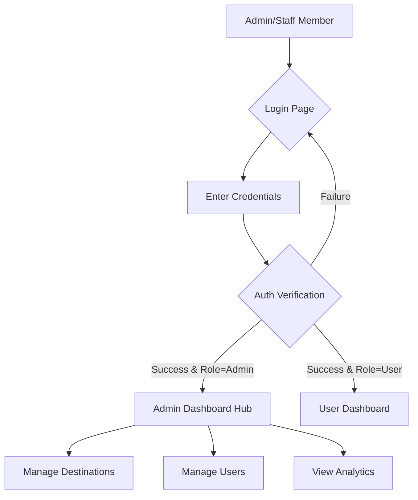
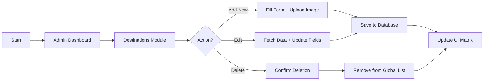
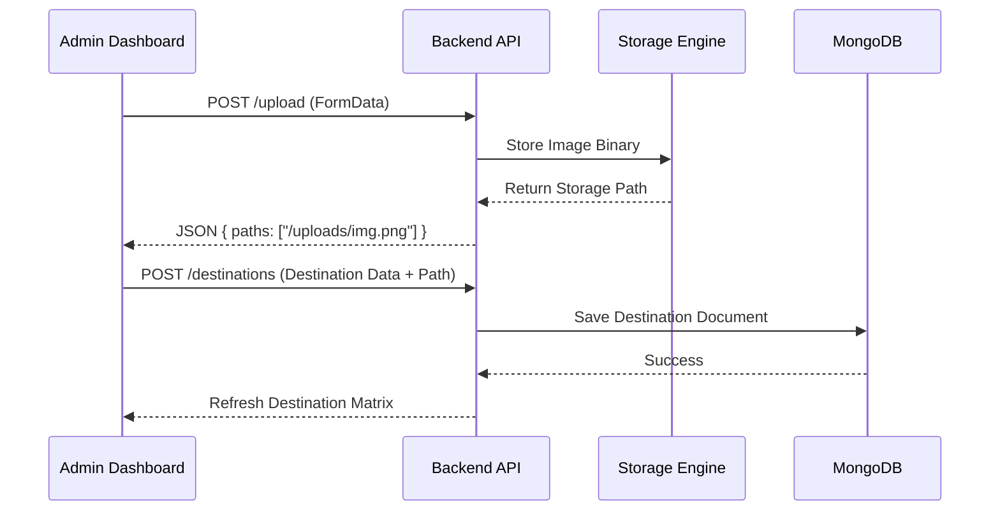
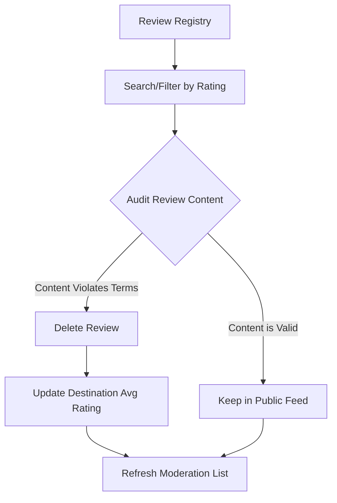

# 🛠️ Admin Panel Documentation

The **Admin Panel** is the centralized mission control for the Bihar Tourism Platform. It provides authorized personnel with the tools to manage destinations, moderate users, monitor platform analytics, and ensure the integrity of community-generated content.

---

## 📊 Dashboard Hub

The main dashboard (`/admin`) provides a high-level "Matrix" view of the platform's health:
- **Real-time Analytics**: Tracks Total Users, Destinations, Reviews, and Trip Plans.
- **Top Performers**: Leaderboard of destinations based on traveler ratings and engagement.
- **User Trip Plans Matrix**: A global view of all user-generated itineraries, allowing admins to monitor and manage traveler activity.

---

## 🏗️ Administrative Modules

### 1. Destination Management (`/admin/destinations`)
Allows for the full lifecycle management of tourism spots.
- **CRUD Operations**: Admins can create, read, update, and delete destination entries.
- **Image Pipeline**: Integrated upload system for high-resolution destination covers.
- **Metadata Management**: Fine-tuning of coordinates, eco-scores, budget levels, and seasonal info.

### 2. User & Moderation Hub (`/admin/users`)
A robust system for managing the platform's population.
- **RBAC (Role-Based Access Control)**: Admins can escalate or de-escalate users to roles like `Co-admin` or `Guest`.
- **Content Moderation**: Deep-dive into specific user profiles to delete inappropriate posts or comments.
- **Visual Tiering**: Roles are distinguished by a star-rating system (3 Stars for Admins, 2 for Co-admins).

### 3. Review Moderation (`/admin/reviews`)
Ensures the quality of traveler feedback by providing tools to approve or remove reviews.

---

## 🗺️ Operational Flow Charts

### 1. Admin Access & Authentication Flow

### 2. Destination Management Lifecycle

### 3. Image Upload Pipeline (Sequence)

### 4. Review Moderation Flow

---

## 🛡️ Role-Based Access Control (RBAC)

The platform implements a strict hierarchy to ensure security:

| Role | Access Level | UI Indicator |
| :--- | :--- | :--- |
| **Admin** | Full system control, role escalation, global deletions. | ⭐⭐⭐ |
| **Co-Admin** | Content moderation, destination updates, user management (limited). | ⭐⭐ |
| **User** | Post content, create trip plans, save favorites. | - |
| **Guest** | Browse content, limited interactions. | ⭐ |

---

## 🛠️ Technical Implementation

### Key Components
- `AdminApi`: Centralized axios instance for administrative endpoints.
- `UserDetailsModal`: A complex modal for reviewing user-specific content.
- `DashboardStats`: Specialized card components for analytics visualization.

### Data Fetching
Admins utilize the `adminApi.getAnalytics()` method on mount, which aggregates data across four different collections (Users, Destinations, Reviews, Itineraries) to populate the dashboard matrix.
